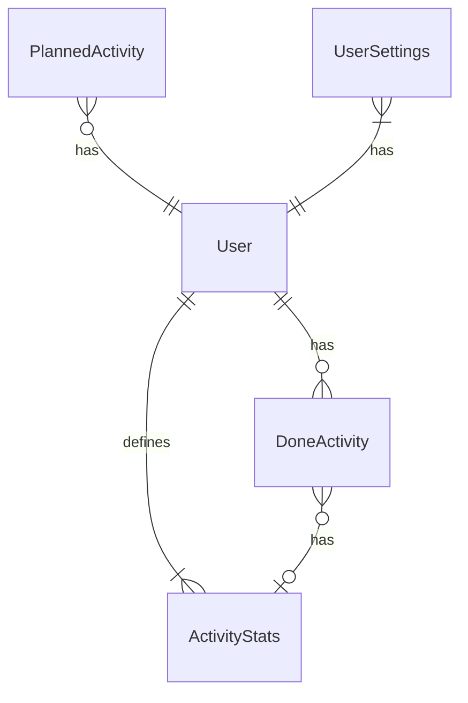

# DB schema

# Logic schema
```mermaid
  graph TD
      TodoList --> TodoModule
    TodoModule --> PlannedActivities
    TodoModule --> RecommendedActivities
      ActivitiesToAdd ---> PresetActivities
      HealthBars --> HealthBarsModule
      HealthBarsModule --> DoneActivities
      History ---> DoneActivities
      HealthBarsModule --> Metrics
      PlannedActivities --> User
      RecommendedActivities --> User
    PresetActivities --> User
      Metrics --> User
      DoneActivities --> User
    
    
